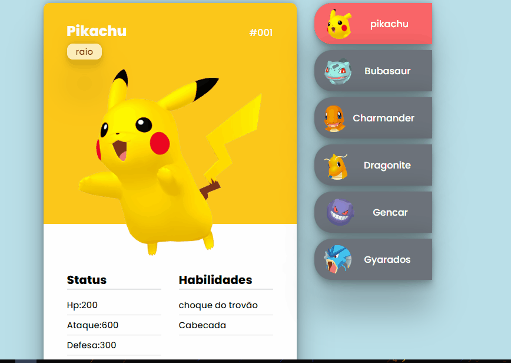

<h1 align="center">
    
</h1>

<h1>
    
</h1>

<h1>
    <a href="https://rickmotasantos.github.io/mapadev-week-pokedex/">Como acessar o Projeto</a>
</h1>

# 📕Índice

- Sobre
- Tecnologias utilizadas
- como baixar

---

# 🎴Sobre

Esse projeto foi feito em aula no curso ***Dev Em Dobro***, ele mostrar vários cards de pokemons falando sobre todas as suas características.

# ⌨ Tecnologias utilizadas

o projeto foi desenvolvido utilizando as seguintes tecnologias:

- Html 5
- Css 3
- JavaScript

# 🐱Como baixar o projeto

```bash

    #clonar o projeto
    $git clone https://rickmotasantos.github.io/mapadev-week-pokedex/

    #entrar no diretório
    $cd rickmotasantos

    #instalar dependências
    $yarn install

    #iniciar o projeto
    $yarn start
```

Desenvolvido ***por Dev em Dobro*** e modificado por ***Ricardo Mota***